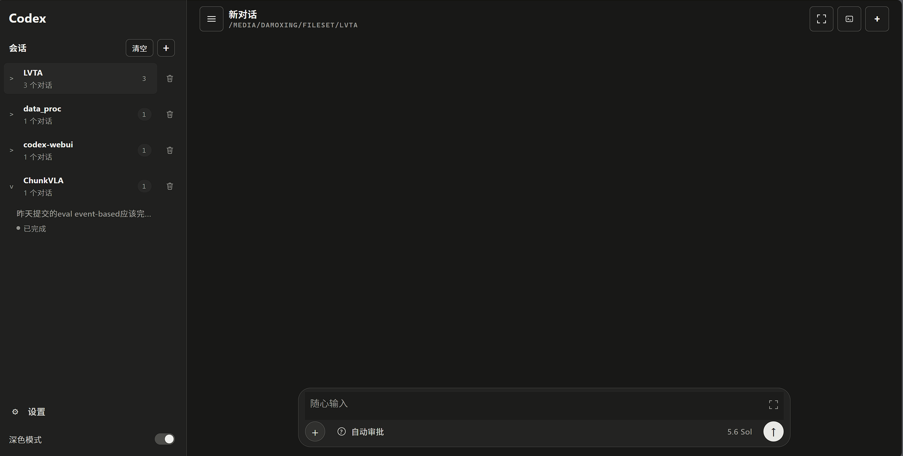

<p align="center">
  <strong>简体中文</strong> · <a href="README_EN.md">English</a>
</p>

# Codex WebUI

一个面向本机 Codex CLI 的浏览器工作台。它把真实 Codex 会话、审批、终端和文件交互放进统一的响应式界面，让本地 agent 工作流在桌面与移动设备上都清晰、可控。



## 项目理念

- **本地优先**：直接使用本机 Codex CLI 与既有会话，项目文件和运行状态由你掌控。
- **过程可见**：流式呈现回复、工具事件与审批请求，长任务可以暂停、恢复和断线续接。
- **控制不缺席**：沙箱、审批策略、终端和远程访问边界都保持显式，便利不以失去控制为代价。
- **一个工作台**：围绕项目组织对话，将附件、文件预览、MCP、Skill 与 Plugin 收拢到同一处。

## 核心功能

- 创建、恢复和管理原生 Codex thread，并按工作目录组织历史会话。
- 流式展示回复与工具事件，支持任务暂停、重连和事件补收。
- 在浏览器内处理命令、文件修改及额外权限审批。
- 上传图片和普通文件；在对话内预览 Markdown、图片、视频及常用文件。
- 提供当前项目目录下的 PTY 终端，以及 MCP、Skill 和 Plugin 管理。
- 桌面与移动端响应式布局，支持安装为桌面或主屏幕应用。

## 快速开始

需要 Node.js 20+，并已安装、登录 Codex CLI：

```bash
git clone https://github.com/myendless1/codex-webui.git
cd codex-webui
npm ci
npm start
```

打开 `http://127.0.0.1:8787`。

> 当前 npm 包尚未公开发布，请从源码安装。局域网或远程使用前，请先阅读部署与安全说明。

## 文档

- [安装与配置](docs/installation.md)
- [使用指南](docs/usage.md)
- [部署、安全与发布维护](docs/deployment.md)
- [English documentation](README_EN.md)

## 当前范围

当前版本只执行本机 Codex CLI；Claude Code 与远程 Codex adapter 暂未启用。

## 致谢

本项目 fork 自 [zxm-bupt/codex-webui](https://github.com/zxm-bupt/codex-webui)，感谢原作者和贡献者的工作。
