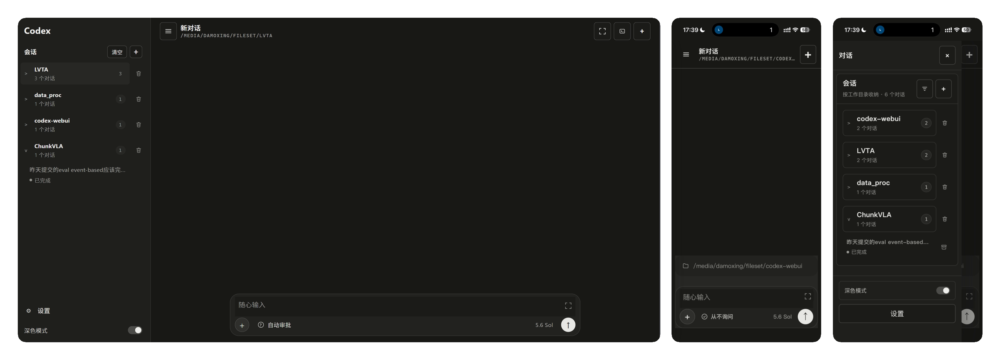

<p align="center">
  <a href="README.md">简体中文</a> · <strong>English</strong>
</p>

# Codex WebUI

A browser workbench for the local Codex CLI. It brings real Codex sessions, approvals, terminals, and file interaction into one responsive interface, keeping local agent workflows clear and controllable on desktop and mobile.



## Philosophy

- **Local first:** use the Codex CLI and sessions already on your machine while retaining control of project files and runtime state.
- **Visible execution:** stream responses, tool events, and approval requests; pause, resume, and reconnect to long-running tasks.
- **Explicit control:** keep sandboxing, approval policies, terminal access, and remote-access boundaries visible.
- **One workbench:** organize conversations around projects and bring attachments, previews, MCP, skills, and plugins together.

## Core features

- Create, resume, and manage native Codex threads grouped by working directory.
- Stream responses and tool events with pause, reconnect, and missed-event recovery.
- Review command execution, file edits, and elevated-permission requests in the browser.
- Upload images and regular files; preview Markdown, images, video, and common file formats in conversations.
- Use a PTY terminal rooted in the current project and manage MCP servers, skills, and plugins.
- Work across responsive desktop and mobile layouts, installable as a desktop or Home Screen app.

## Quick start

Requires Node.js 20+ and an installed, authenticated Codex CLI:

```bash
git clone https://github.com/myendless1/codex-webui.git
cd codex-webui
npm ci
npm start
```

Open `http://127.0.0.1:8787`.

> The npm package is not publicly available yet; install from source. Read the deployment and security guide before enabling LAN or remote access.

## Documentation

- [Installation and configuration](docs/installation-en.md)
- [Usage guide](docs/usage-en.md)
- [Deployment, security, and release maintenance](docs/deployment-en.md)
- [中文文档](README.md)

## Current scope

This release runs the local Codex CLI only. Claude Code and remote Codex adapters are not enabled.

## Acknowledgements

This project is forked from [zxm-bupt/codex-webui](https://github.com/zxm-bupt/codex-webui). Thanks to the original author and contributors.
