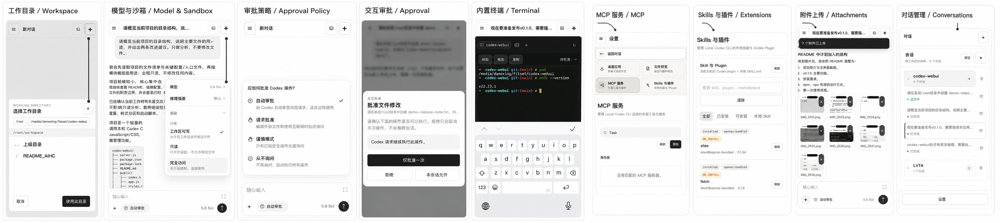

<p align="center">
  <a href="README.md">简体中文</a> · <strong>English</strong>
</p>

# Codex WebUI

A browser console for the local Codex CLI. It brings multi-turn conversations, approvals, a terminal, file previews, MCP servers, plugins, and skills into one responsive interface.



## Features

- Native Codex sessions: create or resume real threads through the Codex App Server, stream responses and tool events, pause tasks, reconnect after interruptions, and collect missed events in order.
- In-browser approvals: review command execution, file changes, and additional permission requests; decline, approve once, or allow the operation for the current session.
- Conversation management: load local Codex history, group conversations by working directory, and show running/completed status. Open a session from its URL, restore context, create or switch conversations, and archive one conversation, a project group, or all conversations. Model, reasoning effort, sandbox, approval policy, and drafts are retained per conversation.
- Attachment uploads: select multiple images or regular files, preview them, and see upload results. Attachments are archived inside the corresponding session directory. Images are sent as native App Server image inputs, while other files are passed as safe local-path context. The default per-file limit is 64 MB.
- File previews: detect local JSON, SVG, image, and video paths in responses and open or embed them directly. Allowed extensions and size limits are configurable; preview copies are stored per session and removed with it.
- MCP and extensions: inspect, add, update, and remove HTTP/stdio MCP servers; install or remove Codex plugins; scan and control local skills.
- Built-in terminal: use an interactive PTY terminal with expand/collapse, automatic reconnection, and touch selection on mobile. Set `ENABLE_TERMINAL=0` to disable it.
- Desktop and mobile: project-oriented desktop navigation, a mobile conversation drawer and new-session sheet, iPhone safe-area and software-keyboard handling, plus desktop/Home Screen installation.
- Remote-access protection: HTTP Basic Auth and same-origin checks for regular HTTP requests and the terminal WebSocket.

## Quick start

Requirements:

- Node.js 20 or newer;
- Codex CLI installed and authenticated;
- the `codex` command available in `PATH`.

### Install

Install globally:

```bash
npm install -g @myendless1/codex-webui
codex-webui
```

Or run without a global installation:

```bash
npx @myendless1/codex-webui
```

The CLI defaults to `http://127.0.0.1:8787`.

### Run from source

```bash
npm install
npm run dev
```

To listen on the LAN, set a strong login password at the same time:

```bash
CODEX_WEBUI_PASSWORD='replace-with-a-strong-password' npm run dev:lan
```

Then open `http://<server-ip>:8787`. The default username is `codex`; override it with `CODEX_WEBUI_USER`.

Common environment options:

```bash
HOST=127.0.0.1 PORT=8787 \
CODEX_BIN=/path/to/codex \
CODEX_WEBUI_DATA_DIR=/path/to/state \
CODEX_WEBUI_MAX_UPLOAD_MB=64 \
codex-webui
```

Runtime state and uploads default to `~/.codex-webui/`. Local and embedded images are archived under `sessions/<session-id>/images/`, and uploads under `sessions/<session-id>/attachments/`. UI actions and upload results are recorded as JSON Lines in `action-events.jsonl` with client and server timestamps.

New-session working directories are selected through the server-side directory picker and validated before use. By default, it can browse the current user's home directory and the directory where the server was started. Restrict the available roots with the platform path separator:

```bash
CODEX_WEBUI_DIRECTORY_ROOTS=/home/euler/workspace:/mnt/projects codex-webui
```

## Usage

### Create and run a conversation

1. Click `+` in the top-right corner and select a project directory in the server-side directory picker.
2. Enter a task; use the `+` at the lower-left of the composer to attach images or regular files when needed.
3. Select the approval policy, model, and reasoning effort. Open “Advanced” to choose read-only, workspace-write, or full-access sandboxing.
4. Send the task to watch streamed responses and tool events. You can pause an active task; after a disconnect, the page attempts to reconnect and retrieve missed events.

### Upload attachments

1. Click the `+` at the lower-left of the composer and select one or more files.
2. Wait for the attachment previews and upload confirmation before sending the message. The default maximum size is 64 MB per file.
3. Images are passed to Codex as native image inputs; regular files are supplied as controlled local-path context.
4. Attachments, archived images, and preview copies are stored per session and removed when that session is archived or deleted.

### Manage conversations

- Use the left sidebar on desktop, or open the conversation drawer from the top-left menu on mobile.
- Conversations are grouped by working directory and show running/completed status. Select an item to restore its history and context.
- Archive one conversation from its row, archive an entire working-directory group from the project header, or use “Clear” to process all conversations.
- Active tasks must be paused before archival. Native Codex conversations are archived; WebUI-only local conversations are deleted.

### Approvals and terminal

- With “Request approval” or “Cautious mode,” commands, file changes, and extra permissions open a browser confirmation dialog. Decline, approve once, or allow for the current session.
- The terminal button opens a PTY shell in the active session's working directory. Mobile controls support paste, touch selection, and copy. The terminal has the permissions of the operating-system user running WebUI, so protect remote access accordingly.

### MCP, skills, and plugins

- Open “Settings → MCP” to search, add, update, or remove STDIO and streaming HTTP MCP servers.
- Open “Settings → Skills & Plugins” to refresh and search extensions, install or remove plugins, and enable or disable local `SKILL.md` files.

## Install as a desktop or Home Screen app

Open “Settings → Desktop app” and click “Add to desktop.” The page selects the available instructions for the current platform.

### Chrome and Edge

When the browser exposes its native install prompt, the settings button opens it directly. Installation normally requires HTTPS, or local access through `http://localhost:8787` / `http://127.0.0.1:8787`. A plain `http://<server-ip>:8787` LAN address is not a secure context, so use a trusted VPN or HTTPS reverse proxy for reliable installation.

### iPhone and iPad

1. Open WebUI in Safari.
2. Tap Safari's Share button.
3. Choose “Add to Home Screen” and confirm.
4. Launch Codex from its Home Screen icon.

iOS/iPadOS does not allow a webpage button to open the Add to Home Screen panel directly. Standalone mode removes Safari's regular bars and is the closest available equivalent to fullscreen on iPhone.

### macOS Safari and browser fullscreen

In Safari, use “File → Add to Dock.” The four-corner button in the WebUI header toggles the browser Fullscreen API where supported; `Esc` or the platform exit gesture restores the button state. The terminal button only switches between conversation and terminal layouts.

Static frontend assets use `Cache-Control: no-store`; after code changes, close and reopen an installed Web App to load the latest version.

## Run as a systemd service

The repository includes a service installer. It runs as the project-directory owner by default and stores editable environment settings in `/etc/default/codex-webui`:

```bash
sudo ./install-webui-service.sh install
sudo ./install-webui-service.sh status
```

Uninstall the service while keeping the environment file:

```bash
sudo ./install-webui-service.sh uninstall
```

For development, `./restart-webui.sh` safely stops this project's old process and starts a background instance. Logs default to `/tmp/codex-webui.log`.

## Automated npm releases

The workflow at `.github/workflows/publish.yml` publishes only when a `v*` tag is pushed and runs `npm test` first. Configure npm Trusted Publishing for the repository, then create and push a release tag without publishing locally:

```bash
np patch --no-publish
```

The package must remain public and the workflow must run on a GitHub-hosted runner.

## Security model

Browsers cannot execute the local CLI directly, so `server.js` is the required trust boundary. Codex CLI commands are spawned with argument arrays. The built-in terminal, however, has the shell permissions of the current system user and must be treated as a privileged remote entry point.

The server binds to `127.0.0.1` by default. `npm run dev:lan` binds to `0.0.0.0`; set `CODEX_WEBUI_PASSWORD` and prefer a trusted VPN/Tailscale or an HTTPS reverse proxy. The service rejects browser requests whose origin host does not match. Long-term public exposure should also add rate limiting, operation auditing, and a stricter network boundary.

This release executes the local Codex CLI only. Claude Code and remote Codex adapters are not enabled.

## Acknowledgements

This project is forked from [zxm-bupt/codex-webui](https://github.com/zxm-bupt/codex-webui). Thanks to the original author and contributors for their work.
